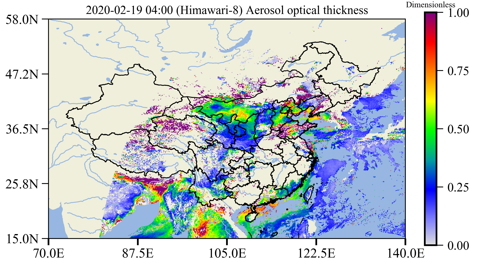

# Himawari8 Visualizer

This repository provides some handy tools to visualize the [Himawari-8][1] data.

**Examples**

<p align='center'>

<br>
<b>Aerosol optical thickness at east Asia</b>

## Download

```bash
git clone https://gitee.com/mualidar/Himawari-8_Visualizer.git   # gitee
cd Himawari-8_Visualizer
```

## Requirements

- Anacodna3 (Python 3.x)
- curlftpfs (Mount JAXA Data server)

Setup python environment:

```bash
conda create -n pyHimawari8
conda activate pyHimawari8

conda install python=3.6 -y
pip install -r requirements.txt
```

## Cron

```bash
crontab -e   # open crontab editor
0 ~/12 * * * ~/anaconda3/envs/pyHimawari8/python /{path}/Himawari-8_Visualizer/pyHimawari8/cron_task.py   # copy this line to crontab schedule, this will activate the visualizer at every 12 hours
```

## Contact

Zhenping Yin <zp.yin@whu.edu.cn>

[1]: http://himawari8.nict.go.jp/